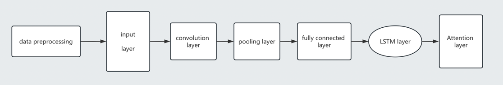
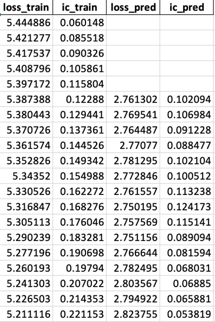

# LSTM_CNN_Prediction

This repository implements a combined Attention-based CNN and LSTM model for time series prediction tasks, including data generation, phase reconstructure and model training processes.

> The idea is from models when analysing chaos time series in physics.

---

## Project Structure

- `configs/`: Contains parameter designs for both the model and datasets. These configuration files allow users to adjust hyperparameters and other settings used in the model.
  
- `utils/`: Provides utility functions used across the project to support model training and evaluation, such as data preprocessing or helper functions.

- `models/`: Includes the implementation of the models used in the project. Below is a breakdown of its sub-components:
  - `dataset_train.py`: Handles the generation of the training dataset.
  - `dataset_pred.py`: Handles the generation of the prediction dataset.
  - `model_runner.py`: The main script that integrates all components and runs the model training and prediction process.
  - `normalization.py`: Contains various data normalization methods, which are critical for time series analysis and model performance.
  - `Modules/`: Implements individual model components, including custom loss functions.
  - `Network/`: Defines the network architecture, including CNN and LSTM layers, and attention mechanisms.

- `generator/`: This folder is responsible for generating the dataset, including how the data is reconstructed in phase space.

- `logs/`: Stores training logs, such as loss, accuracy, and other metrics tracked during the training process.

- `Res/`: Placeholder for storing results generated by the model (e.g., trained models, predictions).

---

## Data Generation

Use the stock market data in China. Daily frequency and minute frequency are useful.

---

## Model Implementation

### Phase Space Reconstruction: 
Before feeding data into the model, the chaotic time series undergoes phase space reconstruction, which is essential for capturing the dynamic system’s state information. 

**Mutual information** is used to determine the time delay `τ`, while **Cao's method** is employed to determine the embedding dimension `m`.

### Convolutional Neural Network (CNN): 
The CNN is employed to extract spatial features from the reconstructed phase space. By applying convolution operations, it can efficiently capture local patterns in the data, which are then passed on to the next stage of the model.

### Long Short-Term Memory (LSTM) Network: 
After obtaining the spatial features from the CNN, the LSTM network is used to model the temporal dependencies of the chaotic time series.

### Attention Mechanism: 
The attention mechanism is incorporated to focus on the most relevant parts of the sequence, both in terms of time and space. This helps the model assign higher weights to important features while down-weighting less relevant ones, thus improving the accuracy of the final prediction.

---

## Result
It can be saved in `Res/`. Here is one of the example of training and predicting result.

